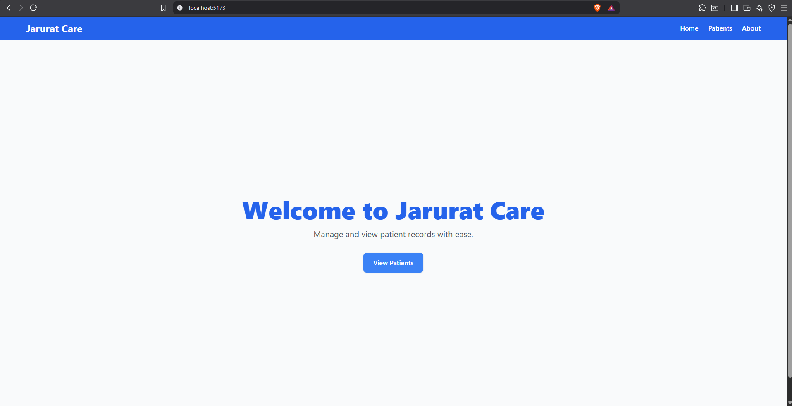
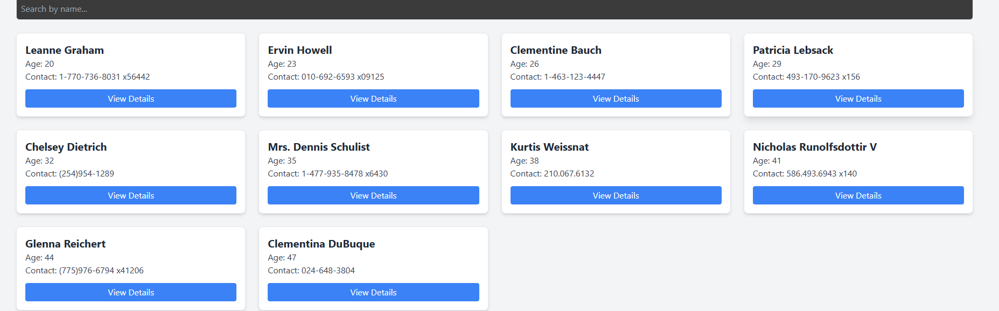
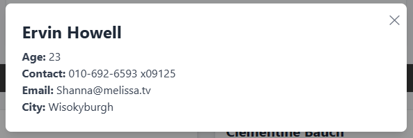
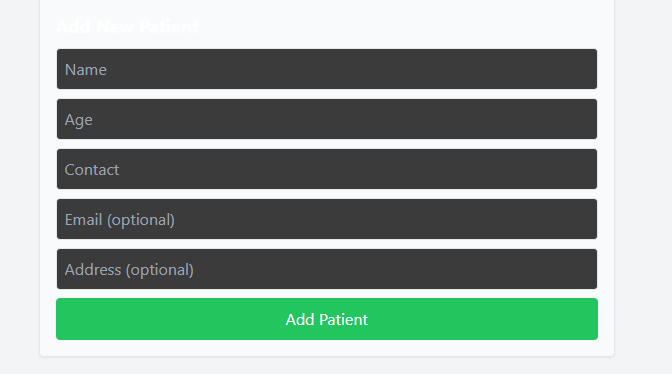

# Jarurat Care - Patient Records Dashboard

A simple React application to manage and view patient records.  
Built using **React**, **Tailwind CSS**, and **JSON Placeholder API** for mock data.

---

## **Features**

- Landing Page with welcome message and navigation
- Patients Page:
  - Fetches patient data from JSON Placeholder API
  - Displays patient list in a responsive grid
  - Search bar to filter patients by name
  - "View Details" modal for each patient
  - Add new patient form (local state only)
- Loading & error handling
- Fully responsive for mobile and desktop

---

## **Screenshots**

  
  
  
  

---

## **Setup Instructions**

1. **Clone the repository**

```bash
git clone https://github.com/YOUR_USERNAME/jarurat-care.git
cd jarurat-care
